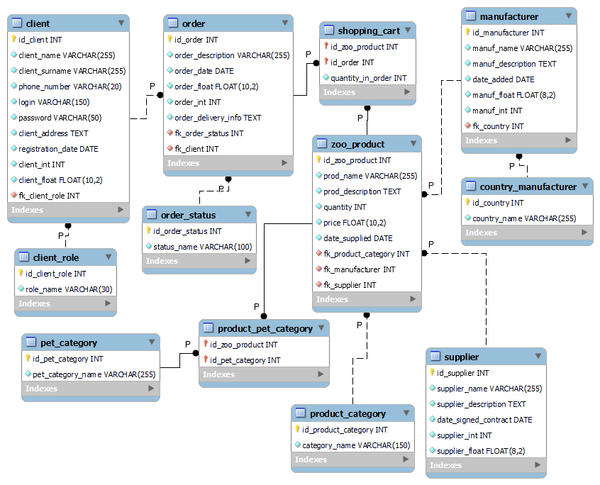

client_role 1:2

order_status 1:5

pet_category 1:13

product_category 1:11

country_manufacturer 1:7

```{r}
client_role_range <- c(1:2)
order_status_range <- c(1:5)
pet_category_range <- c(1:13)
product_category_range <- c(1:11)
country_manufacturer_range <- c(1:7)
```

## Manufacturer

```{r}
id_manufacturer <- c(1:10000)
```

```{r}
manuf_name <- paste0("Виробник №", id_manufacturer)
```

```{r}
set.seed(123)
# create some types of description and put it in random order
manuf_descr <- c("Товари даного виробника вирізняються якістю та стабільністю вже протягом десятків років.",
              "Даний виробник зарекомендував себе як надійний виробник товарів для наших улюбленців.",
             "Виробник, який ставить для себе німецьку якість як пріоритет.",
             "Виробник товарів люкс-класу.",
             "Відомий виробник зоотоварів широкого використання."
             )
manuf_description <- sample(manuf_descr, size = 10000, replace = TRUE)
```

```{r}
start_date <- as.Date("2017-01-01")
end_date <- as.Date("2023-09-08")

set.seed(123)
date_added <- as.Date(sample(as.numeric(start_date):as.numeric(end_date), 
                             10000,
                             replace = TRUE))
```

```{r}
set.seed(123)
manuf_float <- abs(round(rnorm(10000), 2))
```

```{r}
set.seed(123)
manuf_int <- sample(c(1:1000),
                    size = 10000,
                    replace = T)
```

```{r}
set.seed(123)
fk_country <- sample(country_manufacturer_range,
                     size = 10000,
                     replace = T)
```

```{r}
manufacturer <- data.frame(id_manufacturer = id_manufacturer,
                           manuf_name = manuf_name,
                           manuf_description = manuf_description,
                           date_added = date_added,
                           manuf_float = manuf_float,
                           manuf_int = manuf_int,
                           fk_country = fk_country)
head(manufacturer)
```

```{r}
write.csv(manufacturer, 
          "./zooshop_out/manufacturer.csv",
          row.names = FALSE)
```

```{r}
create_manufacturer <- function(df){
        query <- paste0(
"INSERT INTO `zooshop_innodb`.`manufacturer` (`id_manufacturer`, `manuf_name`, `manuf_description`, `date_added`, `manuf_float`, `manuf_int`, `fk_country`) VALUES ( ",id_manufacturer,", '", manuf_name,"', '", manuf_description,"', '", date_added,"', ", manuf_float,", ", manuf_int,", ", fk_country," );")
        return(query)
}
```

```{r}
# write to sql file
file_connection <- file("./zooshop_out/fill_manufacturer.sql")
writeLines(create_manufacturer(manufacturer),
           file_connection)
close(file_connection)

```

## Supplier

```{r}
id_supplier <- c(1:10000)
```

```{r}
supplier_name <- paste0("Постачальник №", id_supplier)
```

```{r}
set.seed(123)
# create some types of description and put it in random order
supp_descr <- c("Поставки товарів даного постачальника вирізняються якістю та стабільністю вже протягом десятків років.",
              "Даний постачальник зарекомендував себе як надійний постачальник товарів для наших улюбленців.",
             "Постачальник, який ставить для себе якість поставлених товарів як пріоритет.",
             "Постачальник товарів люкс-класу.",
             "Відомий постачальник зоотоварів широкого використання."
             )
supplier_description <- sample(supp_descr, 
                               size = 10000, 
                               replace = TRUE)
```

```{r}
start_date <- as.Date("2010-01-01")
end_date <- as.Date("2023-09-08")

set.seed(123)
date_signed_contract <- as.Date(sample(as.numeric(start_date):as.numeric(end_date), 
                             10000,
                             replace = TRUE))
```

```{r}
set.seed(123)
supplier_int <- sample(c(1:2000),
                    size = 10000,
                    replace = T)

```

```{r}
set.seed(123)
supplier_float <- abs(round(rnorm(10000), 2))
```

```{r}
supplier <- data.frame(id_supplier = id_supplier,
                           supplier_name = supplier_name,
                           supplier_description = supplier_description,
                           date_signed_contract = date_signed_contract,
                           supplier_int = supplier_int,
                           supplier_float = supplier_float)
head(supplier)
```

```{r}
write.csv(supplier, 
          "./zooshop_out/supplier.csv",
          row.names = FALSE)
```

```{r}
create_supplier <- function(df){
        query <- paste0("INSERT INTO `zooshop_innodb`.`supplier` (`id_supplier`, `supplier_name`, `supplier_description`, `date_signed_contract`, `supplier_int`, `supplier_float`) VALUES (" ,id_supplier,", '", supplier_name,"', '", supplier_description,"', '", date_signed_contract,"', ", supplier_int,", ", supplier_float," );")
        return(query)
}
```

```{r}
# write to sql file
file_connection <- file("./zooshop_out/fill_supplier.sql")
writeLines(create_supplier(supplier),
           file_connection)
close(file_connection)

```

## Client

```{r}
id_client <- c(1:10000)
```

```{r}
set.seed(1)
cl_names <- c("Маргарита", "Василь", "Петро", "Володимир", "Владислав", "Андрій", "Олена", "Олександра", "Олександр", "Юлія", "Валентина", "Антон", "Анна", "Федор", "Марія", "Валерія", "Іван", "Іванна", "Юрій", "Даниїл", "Вікторія", "Станіслав", "Оксана", "Михайло", "Валентин", "Євген", "Євгенія", "Мирослав", "Мирослава", "Наталія", "Ілона", "Тетяна", "Микита", "Кароліна", "Кирило", "Матвій", "Денис", "Вадим", "Тимур", "Поліна", "Костянтин", "Анастасія", "Борис", "Ростислав", "Максим", "Ксенія", "Ярослав", "Ярослава", "Сергій", "Ольга", "Артем", "Микола", "Софія", "Вячеслав", "Валерій", "Галина", "Ірина", "Надія", "Людмила", "Богдан", "Інна", "Олексій", "Павло", "Катерина", "Лариса", "Віталій", "Христина", "Роман", "Аліна", "Тамара", "Гліб", "Савелій")
client_name <- sample(cl_names,
                    size = 10000,
                    replace = T)
```

```{r}
set.seed(1)
cl_surnames <- c("Мельник", "Шевченко", "Коваленко", "Бондаренко", "Бойко", "Ткаченко", "Кравченко", "Ковальчук", "Коваль", "Олійник", "Шевчук", "Поліщук", "Ткачук", "Савченко", "Бондар", "Марченко", "	Руденко", "Мороз", "Лисенко", "Петренко", "Клименко", "Павленко", "Кравчук", "Кузьменко", "Пономаренко", "Савчук", "Василенко", "Левченко", "Харченко", "Сидоренко", "Карпенко", "Гаврилюк", "Швець", "Мельничук", "Попова", "Романюк", "Панченко", "Юрченко", "Мазур", "Хоменко", "Павлюк", "Кушнір", "Литвиненко", "Мартинюк", "Гончаренко", "Приходько", "Костенко", "Кулик", "Романенко", "Костюк", "Семенюк", "Назаренко", "Ткач", "Кравець", "Коломієць", "Козак", "Яковенко", "Федоренко", "Ковтун", "Білоус", "Нестеренко", "Терещенко", "Колесник", "Зінченко", "Тарасенко", "Міщенко", "Вовк", "Демченко", "Пилипенко", "Кириченко", "Жук", "Гуменюк")
client_surname <- sample(cl_surnames,
                    size = 10000,
                    replace = T)
```

```{r}
set.seed(1)
number_vals <- sample(c(000000000:999999999),
                                size = 10000,
                                replace = T)
phone_number <- paste0("+380", number_vals)
```

```{r}
login <- paste0("login", c(1:10000), "@gmail.com")
```

```{r}
set.seed(1)
password <- stringi::stri_rand_strings(10000, 10)
```

```{r}
library(RMySQL)
library(data.table)
mysql_db_connection <- dbConnect(RMySQL::MySQL(),
                                 dbname = "pharmacy_innodb",
                                 host = "localhost",
                                 port = 3306,
                                 user = "root",
                                 password = "sovyshka07")
query_get_all_addresses <- dbSendQuery(mysql_db_connection,
                                        "select address from pharmacy")
client_address <- data.table(fetch(query_get_all_addresses, n = -1))
dbClearResult(dbListResults(mysql_db_connection)[[1]])
dbDisconnect(mysql_db_connection)
client_address
```

```{r}
set.seed(1)
start_date <- as.Date("2015-01-01")
end_date <- as.Date("2023-09-08")

set.seed(123)
registration_date <- as.Date(sample(as.numeric(start_date):as.numeric(end_date), 
                             10000,
                             replace = TRUE))
```

```{r}
set.seed(1)
client_int <- sample(c(1:1000),
                    size = 10000,
                    replace = T)
```

```{r}
set.seed(1)
client_float <- abs(round(rnorm(10000), 2))
```

```{r}
set.seed(12)
fk_client_role <- sample(client_role_range,
                     size = 10000,
                     replace = T)
```

```{r}
client <- data.frame(id_client = id_client,
                     client_name = client_name,
                     client_surname = client_surname,
                     phone_number = phone_number,
                     login = login,
                     password = password,
                     client_address = client_address,
                     registration_date = registration_date,
                     client_int = client_int,
                     client_float = client_float,
                     fk_client_role = fk_client_role)
head(client)
```

```{r}
library(dplyr)
#client %>% rename(client_address = address)
names(client)[names(client) == "address"] <- "client_address"
write.csv(client, 
          "./zooshop_out/client.csv",
          row.names = FALSE)
```

```{r}
client$client_address <- gsub("'", "", client$client_address)
```

```{r}
fill_client2 <- paste0("INSERT INTO `zooshop_innodb`.`client` (`id_client`, `client_name`, `client_surname`, `phone_number`, `login`, `password`, `client_address`, `registration_date`, `client_int`, `client_float`, `fk_client_role`) VALUES ( " ,client$id_client,", '", client$client_name, "', '", client$client_surname,"', '", client$phone_number,"', '", client$login, "', '", client$password, "', '", client$client_address, "', '", client$registration_date, "', ", client$client_int,", ", client$client_float,", ", client$fk_client_role ,");")
```

```{r}
# write to sql file
file_connection <- file("./zooshop_out/fill_client.sql")
writeLines(fill_client2,
           file_connection)
close(file_connection)
```

## Order

```{r}
id_order <- c(1:10000)
```

```{r}
set.seed(1)
descriptions <- c("Відправити замовлення якомога швидше",
                  "Замовлення містить крихкі товари",
                  "Замовлення містить холодильні блоки",
                  "Перешкоджати попаданню сонячного світла на замовлення", 
                  "Не потребуює особливих умов транспортування")
order_description <- sample(descriptions,
                    size = 10000,
                    replace = T)
```

```{r}
set.seed(1)
start_date <- as.Date("2013-01-01")
end_date <- as.Date("2023-09-09")

set.seed(123)
order_date <- as.Date(sample(as.numeric(start_date):as.numeric(end_date), 
                             10000,
                             replace = TRUE))
```

```{r}
set.seed(1)
order_float <- abs(round(rnorm(10000), 2))
```

```{r}
set.seed(1)
order_int <- sample(c(1:2500),
                    size = 10000,
                    replace = T)
```

```{r}
set.seed(1)
del_add <- client_address
order_delivery_info <- del_add[sample(1:nrow(del_add)),]
```

```{r}
set.seed(1)
fk_order_status <- sample(order_status_range,
                     size = 10000,
                     replace = T)
```

```{r}
set.seed(1)
fk_client <- sample(c(1:10000),
                     size = 10000,
                     replace = T)
```

```{r}
order <- data.frame(id_order = id_order,
                    order_description = order_description,
                    order_date = order_date,
                    order_float = order_float,
                    order_int = order_int,
                    order_delivery_info = order_delivery_info,
                    fk_order_status = fk_order_status,
                    fk_client = fk_client)
head(order)
```

```{r}
library(dplyr)
names(order)[names(order) == "address"] <- "order_delivery_info"
order$order_delivery_info <- gsub("'", "", order$order_delivery_info)
write.csv(order, 
          "./zooshop_out/order.csv",
          row.names = FALSE)
```

```{r}
fill_order <- paste0("INSERT INTO `zooshop_innodb`.`order` (`id_order`, `order_description`, `order_date`, `order_float`, `order_int`, `order_delivery_info`, `fk_order_status`, `fk_client`) VALUES (" ,order$id_order,", '", order$order_description, "', '", order$order_date,"', ", order$order_float,", ", order$order_int, ", '", order$order_delivery_info, "', ", order$fk_order_status, ", ", order$fk_client, ");")
```

```{r}
# write to sql file
file_connection <- file("./zooshop_out/fill_order.sql")
writeLines(fill_order,
           file_connection)
close(file_connection)
```

## Zoo_product

```{r}
id_zoo_product <- c(1:10000)
```

```{r}
prod_names <- c("Мазь Аверсект для догляду за шкірою 15 г",
               "Оридермілий (Oridermyl) 10 г-вушна мазь",
               "ProVet Акаростоп краплі для кішок, собак і кролів (акарицидні препарат) 10мл",
               "Foresto (Форесто) нашийник 70 см",
               "Beaphar BIO Spot on натуральні краплі для цуценят від бліх, кліщів та комарів (1піпетка)",
               "Merial NexGard — жувальна таблетка для захисту собак S (2-4 кг) 3 таблетки",
               "Merial NexGard — жувальна таблетка для захисту собак 10-25 кг (3таблетки)",
               "Simparica (Симпарика) Таблетки від бліх і кліщів для собак вагою від 10 до 20 кг (3 шт.)",
               "Boehringer Ingelheim NexGard Spectra жувальна таблетка 1шт для собак 15-30 кг",
               "Merial NexGard для собак M (4-10кг) 3 таблетки",
               "Beaphar Bio Band нашийник 35 см від бліх, кліщів і комарів для котят",
               "Bayer Bolfo нашийник для кішок 35 см",
               "Вакцина Биокан DHPPi+L 1 доза",
               "Прококс (Procox) антигельментик для собак і цуценят суспензія 7,5 мл, (Bayer, Німеччина)",
               "Bosch Dog premium 20кг корм для собак",
               "T26 Nutram Total 11,4 кг беззерновий корм для собак з ягням",
               "Силікагель 15 л Kotix — наповнювач для туалету",
               "Brit Care Adult Large Breed Lamb & Rice 12кг+2кг - для дорослих собак великих порід",
               "Acana Grass Fed Lamb 17 кг — гіпоалергенний корм для собак із ягням та яблуком",
               "Vitapol Vitapol Economic 1,2 кг Корм для хвилястих папуг (0216)",
               "Vitakraft Premium Menu 0,5 кг для хвилястих папуг",
               "Vitapol Karmeo корм для хвилястих папуг 2,5 кг",
               "Padovan Grandmix Pappagalli 2кг",
               "Vitakraft African Корм для великих африканських папуг 750г",
               "Padovan NaturalMix Esotici 1кг - основний корм для екзотичних птахів",
               "Trixie TX-62696 двоповерховий гамак для шиншил, щурів",
               "Trixie TX-62692 гамак 30 × 30 см для щура або тхора",
               "Happet дерев'янний будиночок для гризунів (18 x 13 x 13,5 см)",
               "Trixie TX-63102 ігровий тунель для кролика 27 × 21 × 80 см",
               "Trixie TX-62691 гамак для хом'яка 18 × 18 см",
               "Trixie TX-5497 миска нержавіюча сталь з гвинтовим кріпленням (300 ml/ø 9 cm)",
               "Trixie TX-60801 миска для хом'яка керамічна 90 мл/ø 8 см",
               "Trixie ТХ-6053 автоматична поїлка для гризунів 250мл",
               "Trixie TX-6051 поїлка для гризунів 50 мл 1шт",
               "Trixie TX-28884 сумка Медісон до 5 кг",
               "Trixie TX-28841 сумка Ryan для кішок і собак до 6 кг",
               "Trixie TX-28940 сумка-переноска Холлі для котів і собак до 15 кг",
               "Croci сумка-переноска Megan для кішок і собак ( 40x20x27 cm)", "Croci сумка-переноска Odette для котів і собак (40x20x30 cm)", "Croci C2078440 Кармен сумка-переноска для котів і собак (36 х 18 х 21 см)", "Trixie TX-36253 сумка-переноска Helen Carrier для котів і собак (19 × 28 × 40 см)",
               "Переноска для собак до 12кг Skudo №1 IATA (ТХ-39735)",
               "Переноска для собак до 5кг Ferplast Atlas Deluxe 10",
               "Переноска для собак до 30 кг Scudo No4 IATA",
               "Ferplast Jet 20 - переноска для собак та дрібних собак до 8кг",
               "Ferplast Superior 75 складана клітка для собак до 12 кг (77 x 51 x h 55 см)",
               "Trixie TX-6285 когтерез для гризунів",
               "Trixie TX-2367 кігтеріз з обмежувачем для гризунів",
               "Trixie ТХ-2559 Засіб проти плям біля очей для собак, кішок,гризунів 50мл",
               "Trixe ТХ-2547 Ear Care — очисний лосьйон для вух тварин",
               "Trixie TX-62811 ігровий рол-годівниця для кроликів 14см",
               "Trixie TX-60811 карусель для мишей, хом'яків ø 17 см",
               "Happet куля для гризунів 4 в 1 (11,5 см)",
               "Trixie TX-61949 набір іграшок для гризунів (люфа, дерево)",
               "Trixie TX-6185 м'яч для ласощів для гризунів (8 см)",
               "Trixie TX-6274 підвісний міст для гризунів 29 × 25 × 9 см",
               "Купалка для шиншил Trixie TX- 63002 (27 × 18 × 16 см)",
               "Бассейн для шиншилл Living World Купалка для шиншилл",
               "Vitapol пісок для шиншил 1,5 кг",
               "Vitapol -пісок для шиншил 5,1 кг (1061)",
               "Клітка для дрібних гризунів Ferplast Combi 1 (40,5 x 29,5 x h 22,5 cm)",
               "Клітка для гризунів Природа Джунгарик",
               "Ferplast Mini Duna Hamster - клітка для хом'яків ( 55 x 39 x h 27 cm)",
               "Клітка для дрібних гризунів Ferplast Olimpia ( 46 x 29,5 x h 54 cm)",
               "Клітка для дрібних гризунів Fop Hamster Bernie Deluxe 53*38*25,5 см",
               "Клітка для дрібних гризунів Ferplast Combi 1 Fun ( 40,5 x 29,5 x h 32,5 cm)",
               "Fop Charme Mary вольєр для шиншил", "Ferplast Casita 80 - клітка для кроликів і морських свинок", "Ferplast Rabbit 100 - клітка для кроликів і морських свинок (95 x 57 x h 46 cm)", "Trixie TX-6243 манеж для тварин ø 210 × 75 см", "Клітка для птахів Природа Німфа хром 70*40*76 см (не розбірна)", "Ferplast Regina клітинка для канарок і маленьких екзотичних птахів (Ø 36,5 x 56 cm)", "Ferplast Max 6 - клітка для папуг", "Fop Lara Big Fun - клітка для дрібних птахів 40 х 27 х 51 см (10720011)", "Fop Ivonne - клітка для дрібних і середніх папуг",
               "Purina Pro Plan Adult Small and Mini Optibalance 7 кг — для собак дрібних порід з куркою (1кг — 215 грн)","Josera JosiDog Economy 15кг (1кг - 58 грн) Німеччина","Purina Pro Plan Medium Puppy Sensitive Skin 12 кг - для цуценят середніх порід з лососем","Pro Plan Adult Small & Mini Sensitive Skin 7кг - для дрібних порід з лососем", "Purina Dog Chow Adult Lamb 14 кг (1кг - 103 грн) Угорщина", "Amity  Eco Adult 20 кг (1кг-68 грн) Іспанія", "Farmina Fun Dog корм для собак з ягням 10 кг (1 кг-75 грн) Італія", "PetQM Dogs Basic with Lamb&Rice 10 кг ( 1кг - 75 грн ) Германия", "Brit Premium Adult L 15 кг (1кг-83 грн) Чехія", "Skipper корм для собак 10 кг (курка та яловичина)", "Dog Chow Active 14кг ( 1кг - 78 грн ) Угорщина", "Purina Pro Plan Delicate 10 кг для кішок з ягням (1 кг — 245 грн)", "Purina Pro Plan Adult Cat 10 кг для кішок з куркою (1кг — 218 грн)", "Feline Perfection з куркою 15кг ( 1кг - 130грн ) (білий мішок) Канада", "Cat Chow Adult 15кг з куркою ( 1кг - 106 грн ) Угорщина", "Kitekat курка/овощі 12кг ( 1 кг- 105 грн) Польща", "Josera JosiCat 18кг ( 1кг - 95грн ) Німеччина", "Salutis 12 кг з куркою (1 кг-80 грн) Польща", "T24 Nutram Total 0,17 кг ( на вагу ) беззерновой корм для кішок з лососем"
               )
prod_name <- sample(prod_names,
                    size = 10000,
                    replace = T)
```

```{r}
prod_descriptions <- read.csv("./zooshop_out/prod_descriptions.csv", 
                             encoding = "UTF-8")
prod_description_ <- prod_descriptions[sample(1:nrow(prod_descriptions)),]
prod_description <- sample(prod_descriptions$prod_description,
                    size = 10000,
                    replace = T)
```

```{r}
set.seed(1)
quantity <- sample(c(0:100),
                     size = 10000,
                     replace = T)
```

```{r}
set.seed(1)
price <- abs(round(rnorm(10000, 500, 233), 2))
```

```{r}
start_date <- as.Date("2022-01-01")
end_date <- as.Date("2023-09-10")

set.seed(123)
date_supplied <- as.Date(sample(as.numeric(start_date):as.numeric(end_date), 
                             10000,
                             replace = TRUE))
```

```{r}
fk_product_category <- sample(product_category_range,
                     size = 10000,
                     replace = T)
```

```{r}
set.seed(1)
fk_manufacturer <- sample(c(1:10000),
                     size = 10000,
                     replace = T)
```

```{r}
set.seed(1)
fk_supplier <- sample(c(1:10000),
                     size = 10000,
                     replace = T)
```

```{r}
zoo_product <- data.frame(id_zoo_product = id_zoo_product,
                          prod_name = prod_name,
                          prod_description = prod_description,
                          quantity = quantity,
                          price = price,
                          date_supplied = date_supplied,
                          fk_product_category = fk_product_category,
                          fk_manufacturer = fk_manufacturer,
                          fk_supplier = fk_supplier)
head(zoo_product)
zoo_product$prod_name <- gsub("'", "", zoo_product$prod_name)
zoo_product$prod_description <- gsub("'", "", zoo_product$prod_description)
write.csv(zoo_product, 
          "./zooshop_out/zoo_product.csv",
          row.names = FALSE)
```

```{r}
fill_zoo_product <- paste0("INSERT INTO `zooshop_innodb`.`zoo_product` (`id_zoo_product`, `prod_name`, `prod_description`, `quantity`, `price`, `date_supplied`, `fk_product_category`, `fk_manufacturer`, `fk_supplier`) VALUES (" ,zoo_product$id_zoo_product,", '", zoo_product$prod_name, "', '", zoo_product$prod_description,"', ", zoo_product$quantity,", ", zoo_product$price, ", '", zoo_product$date_supplied, "', ", zoo_product$fk_product_category, ", ", zoo_product$fk_manufacturer,", ", zoo_product$fk_supplier, ");")
```

```{r}
# write to sql file
file_connection <- file("./zooshop_out/fill_zoo_product.sql")
writeLines(fill_zoo_product,
           file_connection)
close(file_connection)
```

## Shopping_cart

```{r}
set.seed(1)
id_zoo_product <- sample(c(1:10000),
                     size = 10000,
                     replace = T)
```

```{r}
id_order <- sample(c(1:10000),
                     size = 10000,
                     replace = T)
```

```{r}
set.seed(1)
quantity_in_order <- sample(c(1:15),
                     size = 10000,
                     replace = T)
```

```{r}
shopping_cart <- data.frame(id_zoo_product = id_zoo_product,
                            id_order = id_order,
                            quantity_in_order = quantity_in_order)
head(shopping_cart)
```

Delete duplicating rows:

```{r}
library(dplyr)
#count duplicated
#sum(shopping_cart[duplicated(shopping_cart)])
shopping_cart %>% distinct(id_zoo_product,
                           id_order,
                           .keep_all = TRUE)
#shopping_cart <- shopping_cart[!duplicated(shopping_cart$id_zoo_product, shopping_cart$id_order)]
```

```{r}
write.csv(shopping_cart, 
          "./zooshop_out/shopping_cart.csv",
          row.names = FALSE)
```

```{r}
fill_shopping_cart <- paste0("INSERT INTO `zooshop_innodb`.`shopping_cart` (`id_zoo_product`, `id_order`, `quantity_in_order`) VALUES (" , shopping_cart$id_zoo_product,", ", shopping_cart$id_order, ", ", shopping_cart$quantity_in_order, ");")
```

```{r}
# write to sql file
file_connection <- file("./zooshop_out/fill_shopping_cart.sql")
writeLines(fill_shopping_cart,
           file_connection)
close(file_connection)
```

## Product_pet_category

```{r}
id_zoo_product <- sample(c(1:10000),
                     size = 10000,
                     replace = T)
```

```{r}
id_pet_category <- sample(pet_category_range,
                     size = 10000,
                     replace = T)
```

```{r}
product_pet_category <- data.frame(id_zoo_product = id_zoo_product,
                                   id_pet_category = id_pet_category)
head(product_pet_category)
```

Delete duplicating rows:

```{r}
library(dplyr)
#product_pet_category %>% distinct(id_zoo_product, id_pet_category,.keep_all = FALSE)
product_pet_category <- unique(product_pet_category)
```

```{r}
nrow(product_pet_category)
```

```{r}
write.csv(product_pet_category, 
          "./zooshop_out/product_pet_category.csv",
          row.names = FALSE)
```

```{r}
fill_product_pet_category <- paste0("INSERT INTO `zooshop_innodb`.`product_pet_category` (`id_zoo_product`, `id_pet_category`) VALUES (" , product_pet_category$id_zoo_product,", ", product_pet_category$id_pet_category, ");")
```

```{r}
# write to sql file
file_connection <- file("./zooshop_out/fill_product_pet_category.sql")
writeLines(fill_product_pet_category,
           file_connection)
close(file_connection)
```
